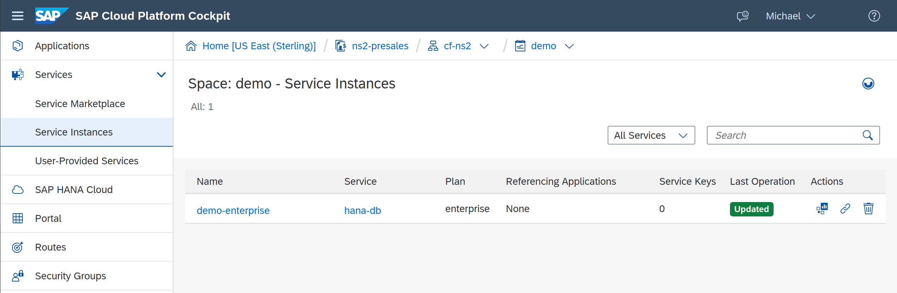
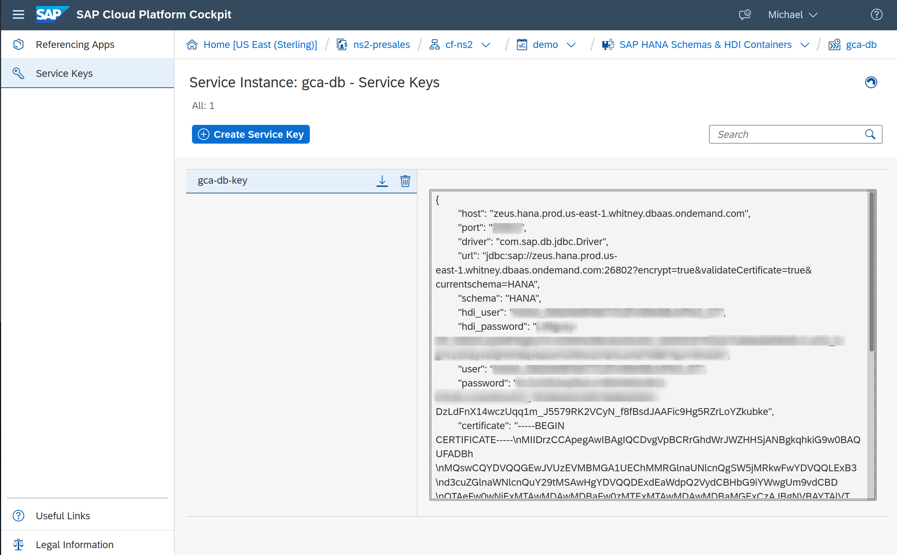

# Global Conflict Analysis Hana Database Module

This application will deploy a [SAP HANA database](https://www.sap.com/products/hana.html) on [SAP Cloud Platform](https://cloudplatform.sap.com/index.html.) with [Predictive Analytics](https://bit.ly/3ft9QVV) capability with data from the [Armed Conflict Location and Event Data project (ACLED)](https://acleddata.com) as well as the [Fragile States Index](https://fragilestatesindex.org/)

## Requirements

* A currently deployed enterprise instance of SAP HANA



* [Cloud Foundry CLI](https://docs.cloudfoundry.org/cf-cli/)

* [Multiapps CF CLI Plugin](https://github.com/cloudfoundry-incubator/multiapps-cli-plugin)

## Deploy

* Make sure the `cli` is connected to your space with this script

```bash
./cf-login.sh
```

* Run the deployment script

```bash
./cf-db.sh
```

## Bugfix workaround

* Currently the ACLED data is **not** loaded on initial creation, due to an allocation bug with both database container, table and content creation at the same time.

* The workaround is to run the `cf-db.sh` script as is, then edit the `db/src/data/acled_full.hdbtabledata` config file and change the following parameter from `true` to

```json
"no_data_import": false
```

* Now run the `cf-db.sh` script again and everything will be imported!

## Access the database

* Get the access configuration from the service keys section of the instance in the cockpit or with the `cli` with the following command

```bash
cf service-key gca-db gca-db-key
```

